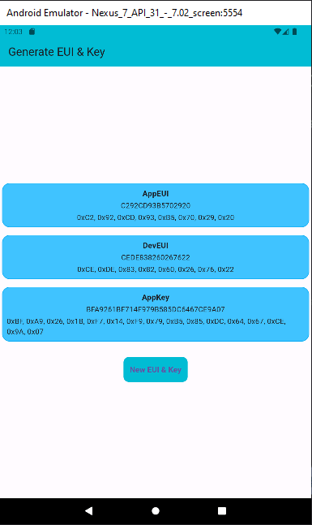

# random_eui_key

This is a Flutter adaptation of https://www.thethingsnetwork.org/forum/t/deveui-for-non-hardware-assigned-values/2093/23 post on the TTN forum

## Table of Contents
- [Demo](##-demo)
- [Getting Started](##-getting-started)
    - [Prerequisites](###-prerequisites)
    - [Installation](###-installation)
- [Usage](##-usage)
- [License](license.txt)

## Demo

## Getting Started

### Prerequisites
You need to have Flutter installed on your pc.

- [Install Flutter](https://flutter.dev/docs/get-started/install)

### Installation
-1. Clone the repo using: git clone https://github.com/JohanScheepers/random_eui_key.git
-2. To get the packages needed for the app, run:

    flutter pub get

## Usage
If you have a connected device or emulator running, you can run the app with:

    flutter run

📝 License
This project is [MIT](license.txt) licensed.